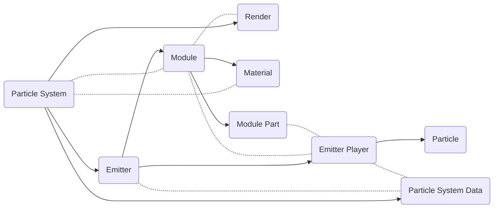
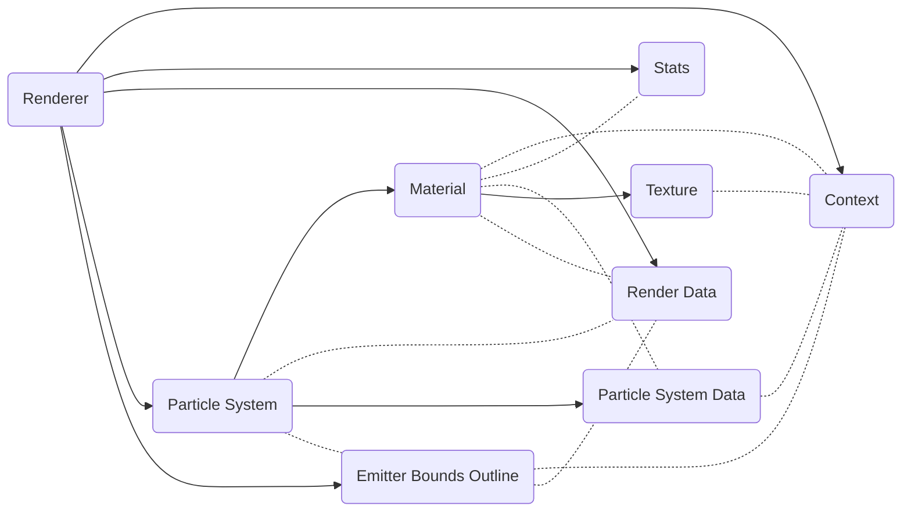

# particle_system_core

A core component of the particle system to construct model of the particle system.

The renderer is a test render of webgl for testing.

Its target WebGL version is WebGL1.

## Core

### Renderer

